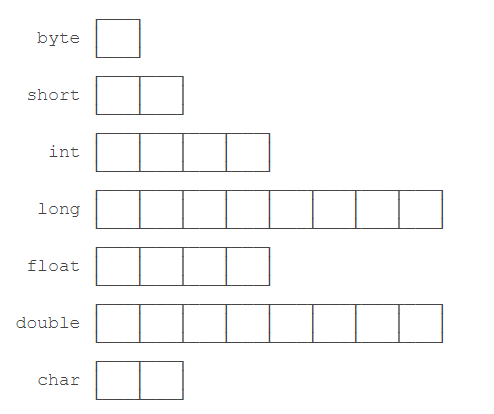

# Java数据类型

*基本数据类型*： 基本数据类型是CPU 可以直接进行运算的类型

* 整数类型 ： byte    short int  long

* 浮点类型 ： float double

* 字符类型 :  char

* 布尔类型 ： boolean

## Java定义的这些基本数据类型有什么区别呢

计算机内存的最小存储单元是字节（byte），一个字节就是一个8位二进制数，即8个bit。
一个字节是1byte，1024字节是1K，1024K是1M，1024M是1G，1024G是1T

1. 一个拥有4T内存的计算机的字节数量就是：
4T = 4 x 1024G
    = 4 x 1024 x 1024M
    = 4 x 1024 x 1024 x 1024K
    = 4 x 1024 x 1024 x 1024 x 1024
    = 4398046511104
2. 不同的数据类型占用的字节数不一样。我们看一下Java基本数据类型占用的字节数：



## 整型

对于整型类型，Java只定义了带符号的整型，因此，最高位的bit表示符号位（0表示正数，1表示负数）。各种整型能表示的最大范围如下：

* byte：-128 ~ 127
* short: -32768 ~ 32767
* int: -2147483648 ~ 2147483647
* long: -9223372036854775808 ~ 9223372036854775807

## 浮点数

浮点类型的数就是小数，因为小数用科学计数法表示的时候，小数点是可以“浮动”的，如1234.5可以表示成12.345x102，也可以表示成1.2345x103，所以称为浮点数。

```java
float f1 = 3.14f;
float f2 = 3.14e38f; // 科学计数法表示的3.14x10^38
double d = 1.79e308;
double d2 = -1.79e308;
double d3 = 4.9e-324; // 科学计数法表示的4.9x10^-324
```

对于float类型，需要加上f后缀。

浮点数可表示的范围非常大，float类型可最大表示3.4x1038，而double类型可最大表示1.79x10308。

## 布尔类型

布尔类型boolean只有true和false两个值

## 字符类型

字符类型char表示一个字符。Java的char类型除了可表示标准的ASCII外，还可以表示一个Unicode字符，

**注意** char类型 使用单引号'，且仅有一个字符，要和双引号"的字符串类型区分开。

## 常量

定义变量的时候，如果加上final修饰符，这个变量就变成了常量。

常量在定义时进行初始化后就不可再次赋值，再次赋值会导致编译错误

## var 关键字

如果想省略变量类型，可以使用var关键字，编译器会根据赋值语句自动推断出变量的类型

## 变量的作用范围

在语句块中定义的变量，它有一个作用域，就是从定义处开始，到语句块结束。超出了作用域引用这些变量，编译器会报错
